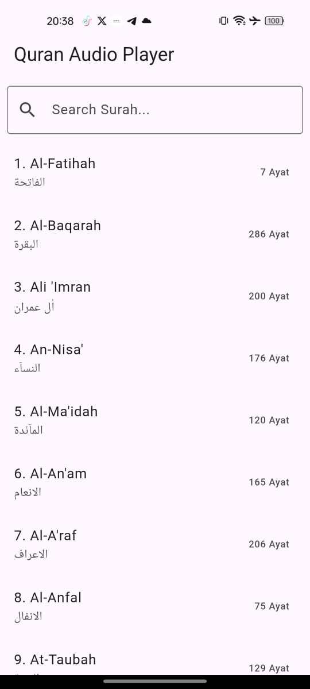
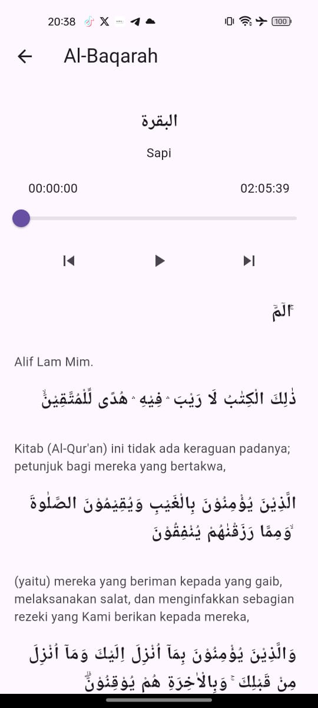
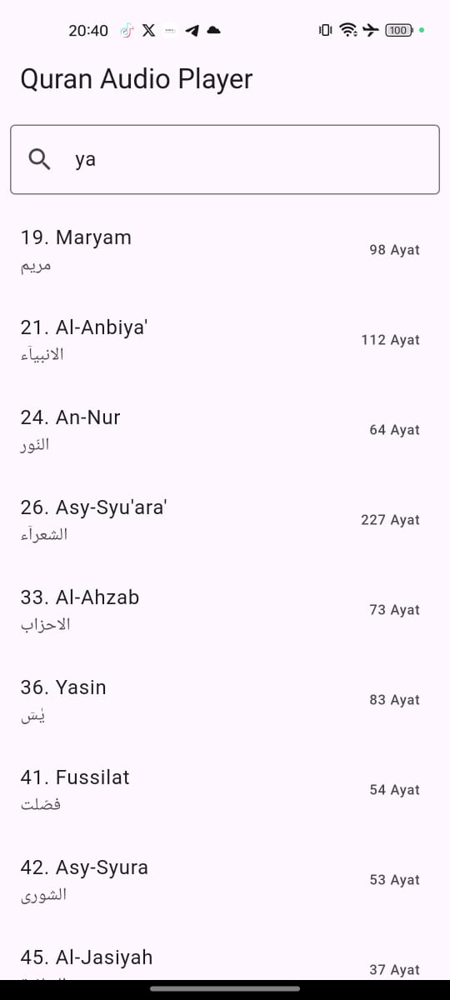

# Quran Audio Player

Aplikasi pemutar audio Al-Qur'an berbasis Flutter dengan fitur play/pause, pencarian surah, dan navigasi antar surah.

  

## Features
- Play / Pause audio Al-Qur'an
- Navigasi antar surah
- Pencarian surah

## Installation

```bash
git clone https://github.com/username/quran-audio-player.git
cd quran-audio-player
flutter pub get
flutter run
```


### **Tech Stack / Dependencies**
Teknologi yang digunakan.

```markdown
## Built With
- Flutter
- BLoC
- Just Audio
- MVVM Architecture
```

## Folder Structure
- lib/
  - bloc/
  - models/
  - repository/
  - views/


## Author
Arlinno Ganda – https://github.com/zeph1re